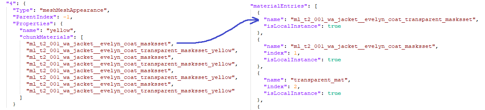
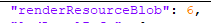
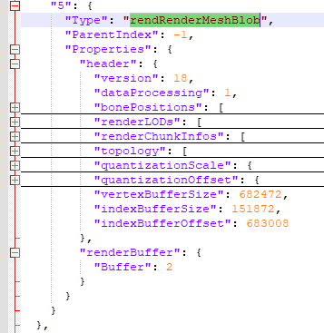
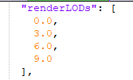

<h1> Mesh File </h1>

REDEngine4 .mesh file is a W2RC file that stores 3d models and their related data, the base W2RC file stores the object data and description about the actual Geometry Data stored inside the buffers, lets break it down some of these files

Note: We will only break down certain properties that we know what they are and of interest to us, also not every mesh file is the same taking advantage of the supported features so we will mix multiple files.

It contains a Chunk Of Type **CMesh** which describes the entire file.

  

<h3>Properties</h3>

* **boundingBox**: it defines the maximum and minimum coordinate values for the vertices. 
* **materialEntries**: its a list containing a description about materials, like name, localInstance(meaning the material data in embedded in the .mesh file itself either as buffered or in chunks) or external(referencing a .mi file path) and index which is relative to the external or local material data reference list.   
  
The lists are of 5 types namely *ExternalMaterials*, *PreloadExternalMaterials***, *LocalMaterialInstances*, *PreloadLocalMaterialInstances*, and finally *LocalMaterialBuffer*. 
*ExternalMaterials* and *PreloadExternalMaterials* are the same thing, they reference an external .mi file and either one of them is intialized only at a time otherwise there will be ambiguity about indexing. 
*LocalMaterialInstances*, *PreloadLocalMaterialInstances*, and *LocalMaterialBuffer* embeds the materials data locally either in Chunks or in *Material Buffer*, again either any one of the 3 can be initialized at a time otherwise indexing ambiguity occurs. *LocalMaterialInstances*, *PreloadLocalMaterialInstances* reference a chunk index while *LocalMaterialBuffer* speficies the buffer index along with offsets and data size for the packed [.mi](./mi.md) files. 
* **appearances**: Its a list containing chunk indices for appearance definitions.  
a *meshMeshAppearance* chunk defines a unique appearance for the entire 3D model by specifying *chunkMaterials*(names pointing to **materialEntries**) for submeshes individually.  
* **boneNames**: Its a list of bone/node names sorted properly that will be used for skinning the submeshes and binding them to armatures.  
* **floatTrackNames**: Its a list of individual tracknames that are used for animations, mostly used for facial anims.  
* **lodLevelInfo**: Its list specifying individual displacements(in meters between the player and origin of the mesh in the world coordinate) for LOD submeshes to be replaced.  
* **renderResourceBlob**: Is a chunk index to *rendRenderMeshBlob* which defines and describes the Geometry Data in the *renderBuffer*.
  

<h3>RendRenderMeshBlob</h3>
  

<h3>Properties</h3>

* **bonePositions**: Its a list containing model space 3D coordinates for bone positions.   
* **renderLODs**: Its list specifying individual displacements(in meters between the player and origin of the mesh in the world coordinate) for LOD submeshes to be rendered.  
* **quantizationScale** & **quantizationOffset**: As the name specifies its used to dequantize Int16 vertex positions to floats.  
* **Buffer Data Section Description**:  *vertexBufferOffset* has a implicit value of 0(vertex data in the buffer should always start from orgin), *vertexBufferSize*: 16 Byte Padded vertex data stream size *indexBufferOffset*: where the indices data start in Buffer, *indexBufferSize*: indices data stream size.
* **renderChunkInfos**: List Of *rendChunk* that describe the mesh data for each submesh.   

